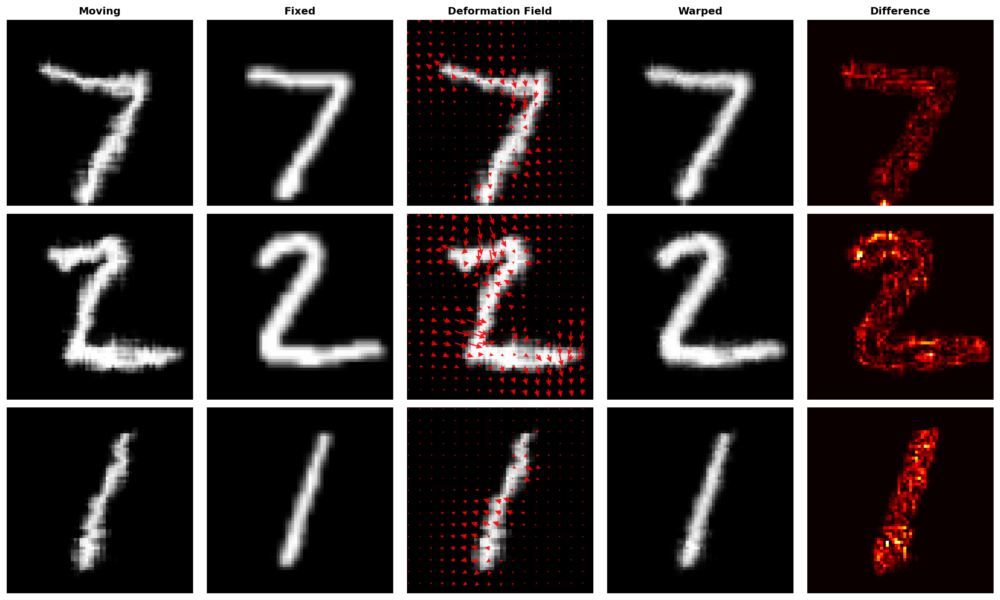
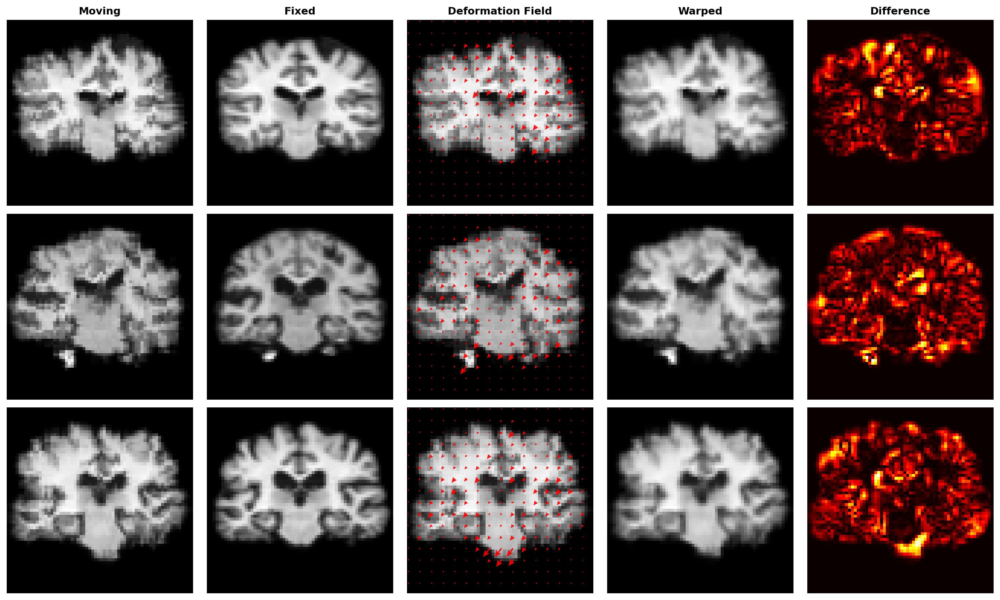

# VoxelMorph in PyTorch

This repository contains a small, educational PyTorch implementation of a VoxelMorph-style model for deformable image registration. It includes runnable MNIST and MRI examples, training-loss plots, registration visualizations, and saved model checkpoints.

> **Scope:** This project is a learning implementation, not a clinical tool or a full reproduction of every detail in the original VoxelMorph work. In the supplied training loop, both MNIST and MRI images are synthetically deformed to create training pairs. The model learns to align those pairs without being given the deformation field as a target.

## Background and references

VoxelMorph learns a function that takes a moving image and a fixed image and predicts a spatial deformation field. The field warps the moving image toward the fixed image. The original work showed that this registration can be learned without ground-truth deformation labels by optimizing an image-similarity objective together with a deformation regularizer.

- Paper: [An Unsupervised Learning Model for Deformable Medical Image Registration](https://openaccess.thecvf.com/content_cvpr_2018/html/Balakrishnan_An_Unsupervised_Learning_CVPR_2018_paper.html)
- Official project and code: [voxelmorph/voxelmorph](https://github.com/voxelmorph/voxelmorph)

This repository implements the core idea in 2D with PyTorch. Its network is a compact U-Net-style encoder/decoder, and its examples use mean squared error (MSE) plus a smoothness penalty on the predicted displacement field.

## What is image registration?

Image registration aligns two images of the same scene or anatomy that differ in position or shape:

- **Fixed image**: the reference image whose coordinate system is the target.
- **Moving image**: the image to transform so that it aligns with the fixed image.
- **Displacement field (flow)**: a 2D vector at each pixel describing where the sampler should read from the moving image.
- **Warped image**: the result of sampling the moving image at coordinates offset by the predicted displacement field.

The network does not output a new image directly. It predicts a dense field with two channels, horizontal (`dx`) and vertical (`dy`) displacement, and a differentiable spatial sampler applies the field to the moving image.

## Repository layout

```text
.
├── models.py           # Conv blocks and the VoxelMorph-style network
├── utils.py            # Synthetic deformations, warping, losses, training, inference plots
├── dataset.py          # MNIST and .npz MRI datasets and DataLoaders
├── train.py            # Configuration and end-to-end train/save/inference entry point
├── requirements.txt    # Environment packages (currently a broad, pinned environment snapshot)
├── data/
│   ├── tutorial_data.npz # MRI tutorial data expected by the MRI loader
│   └── MNIST/            # Downloaded MNIST files (created automatically if needed)
├── checkpoint/         # Example saved state_dict checkpoints
└── results/            # Example loss and registration figures
```

## How this implementation works

### Network architecture

`models.VoxelMorph` accepts `moving` and `fixed` tensors shaped `[B, 1, H, W]` and concatenates them into a two-channel input. The encoder uses three convolution blocks (32, 64, and 128 feature channels) with average pooling between levels. The decoder upsamples bilinearly and joins encoder features through skip connections. A final 3×3 convolution predicts a two-channel displacement field at the original image resolution.

The final flow layer is initialized with very small weights and zero bias, so the initial prediction is close to no deformation. `utils.warp_image` makes a pixel-coordinate grid, adds the displacement, converts coordinates to the `[-1, 1]` range, and calls `torch.nn.functional.grid_sample` with bilinear interpolation and border padding. This sampling convention means the field specifies source coordinates used to construct each output pixel.

The current model and warping code are **2D**. They are not a 3D volumetric network.

### Moving and fixed images in the example training loop

For each training batch, the code treats each image as a fixed image. It generates a random smooth displacement field, warps the fixed image with that field, and calls the result the moving image:

```text
fixed image ── apply random smooth field ──> moving image
     │                                        │
     └──────────── model(moving, fixed) ──────┘
                           │
                    predicted field
                           │
               warp moving image → warped image
```

The random field is created from noise, smoothed using average pooling, normalized per image, and scaled to a maximum magnitude of about five pixels. The network is trained to recover a field that makes the moving image resemble the fixed image. It is **not** trained to match the known synthetic field directly; the generated field is used only to create the input pair.

At inference time, `run_inference` follows the same demonstration protocol: it takes a test batch, synthesizes a random deformation to create moving images, registers them against their original fixed images, then saves visualizations. For a real registration application, replace this synthetic-pair creation with your actual moving/fixed image pairs and use preprocessing appropriate to your data.

### Loss function

The training objective in `utils.train_voxelmorph` is:

$$L = L_{\text{sim}}(F, W) + \lambda L_{\text{smooth}}(u), \qquad \lambda=0.05$$

where `F` is fixed, `W` is the warped moving image, and `u` is the predicted displacement field.

- **Similarity loss:** `mean((fixed - warped) ** 2)`. This encourages the warped image to match the fixed image in intensity.
- **Smoothness loss:** mean squared first differences of the flow horizontally and vertically. This discourages abrupt pixel-to-pixel changes in displacement.
- **Weight:** the smoothness term is multiplied by `0.05` in the current training code.

There is no supervised flow loss, segmentation loss, or validation-based model selection in the supplied loop. MSE is most meaningful when image intensities have been prepared consistently; other datasets may require a different similarity measure and regularization weight.

## Environment setup

Use Python 3.10 as a practical starting point for the pinned PyTorch versions in `requirements.txt`. Install a PyTorch build compatible with your operating system and accelerator; the file currently pins CUDA 11.8 builds, which may not suit every machine.

### Windows PowerShell

```powershell
py -3.10 -m venv .venv
.\.venv\Scripts\Activate.ps1
python -m pip install --upgrade pip
```

### Linux or macOS

```bash
python3.10 -m venv .venv
source .venv/bin/activate
python -m pip install --upgrade pip
```

Then install dependencies:

```bash
pip install -r requirements.txt
```

`requirements.txt` is a large pinned snapshot that includes packages unrelated to this implementation. If installation fails because of platform-specific CUDA pins, install compatible versions of PyTorch and torchvision for your system, then install the remaining required packages (`numpy`, `matplotlib`, and `tqdm`). `torchvision` must be compatible with the installed PyTorch version.

The training script automatically selects CUDA when available and otherwise uses CPU. A CUDA-capable GPU is recommended for faster training, but is not required for the small default experiments.

## Data

### MNIST

Set `DATASET_NAME = "mnist"` in `train.py`. The loader downloads MNIST under `./data` when necessary, resizes images to 64×64, and uses the first 10,000 training examples and first 1,000 test examples by default. MNIST is a convenient smoke-test dataset, not medical imaging data.

### MRI tutorial data

Set `DATASET_NAME = "mri"` in `train.py`. The loader expects `data/tutorial_data.npz` containing NumPy arrays named `train` and `validate`. The included data file can be used if present. Otherwise, obtain the tutorial archive from the [VoxelMorph tutorial data page](https://surfer.nmr.mgh.harvard.edu/pub/data/voxelmorph/tutorial_data.tar.gz), extract it, and put `tutorial_data.npz` in `data/`.

Each MRI item is converted to a float32 tensor, resized to the configured square size, and returned with a dummy label (the training code ignores labels). Confirm that your own `.npz` data uses the expected keys and image layout before training.

## Train, save, and run inference

From the repository root with the environment active:

```bash
python train.py
```

The script seeds Python, NumPy, and PyTorch, builds the selected DataLoaders, creates the model, trains with Adam, saves a loss plot, writes the model weights, and runs the demonstration inference/visualization pass. Default settings in `train.py` are:

| Setting | Default |
| --- | ---: |
| Dataset | `mnist` |
| Image size | 64 × 64 |
| Batch size | 32 |
| Epochs | 10 |
| Learning rate | 0.001 |
| Training examples | 10,000 |
| Test examples | 1,000 |
| Random seed | 42 |

To run on MRI, edit `DATASET_NAME` to `"mri"`. Adjust the constants near the top of `train.py` to change the dataset, number of examples, epochs, batch size, image size, or learning rate. The training function currently sets `smooth_lambda = 0.05` and the synthetic displacement magnitude to 5 pixels in `utils.py`.

Expected outputs for dataset name `mnist` are:

- `checkpoint/model_mnist.pth` — model `state_dict` weights.
- `results/mnist_train_loss.png` — average training loss by epoch.
- `results/mnist_registration_results.png` — example registration visualizations.

The corresponding MRI output names use `mri`. The repository already includes example checkpoints and figures; running training overwrites the outputs for the selected dataset.

## Using a saved model for inference

The checkpoint contains only the model parameters, so instantiate the same architecture before loading it. Example for a tensor pair already prepared as `[B, 1, H, W]`:

```python
import torch
import models

device = torch.device("cuda" if torch.cuda.is_available() else "cpu")
model = models.VoxelMorph().to(device)
state = torch.load("checkpoint/model_mnist.pth", map_location=device)
model.load_state_dict(state)
model.eval()

# moving and fixed must be float tensors of shape [B, 1, H, W]
moving = moving.to(device)
fixed = fixed.to(device)
with torch.no_grad():
    warped, displacement = model(moving, fixed)
```

`warped` has shape `[B, 1, H, W]`; `displacement` has shape `[B, 2, H, W]`, with channel 0 representing horizontal displacement and channel 1 vertical displacement. Make sure the input size, intensity scaling, channel count, and preprocessing match the data used for training. The provided MNIST checkpoint was trained on MNIST-style synthetic pairs and should not be assumed to register MRI or other modalities well.

## Understanding the result figures

`utils.run_inference` saves a figure with three examples (or fewer if the batch is smaller). Each row contains:

1. **Moving**: synthetically deformed input image.
2. **Fixed**: target reference image.
3. **Deformation field**: predicted displacement vectors overlaid on the moving image. The vector display is subsampled for readability.
4. **Warped**: moving image sampled with the predicted field.
5. **Difference**: absolute pixelwise difference between fixed and warped images.

The difference image and loss plot help inspect behavior, but they are not a complete evaluation. For real datasets, evaluate on held-out image pairs and use suitable task metrics (for example, landmark error, overlap of anatomical labels, or Jacobian/folding analysis), in addition to visual review.

### MNIST Result


### MRI Result


## Main code entry points

- `models.py`: `VoxelMorph.forward(moving, fixed)` returns `(warped, displacement)`.
- `utils.py`: `create_random_deformation`, `warp_image`, `similarity_loss`, `smoothness_loss`, `train_voxelmorph`, and `run_inference`.
- `dataset.py`: `get_dataloader(dataset_name, data_dir, img_size, batch_size, num_train, num_test)` returns training and test DataLoaders.
- `train.py`: the runnable experiment configuration and orchestration.

## Citation

If this implementation or the original method informs your work, cite the paper and refer to the official VoxelMorph project:

```text
Balakrishnan, G., Zhao, A., Sabuncu, M. R., Guttag, J., & Dalca, A. V.
An Unsupervised Learning Model for Deformable Medical Image Registration.
IEEE/CVF Conference on Computer Vision and Pattern Recognition (CVPR), 2018.
https://doi.org/10.1109/CVPR.2018.00860
```

Official code: https://github.com/voxelmorph/voxelmorph